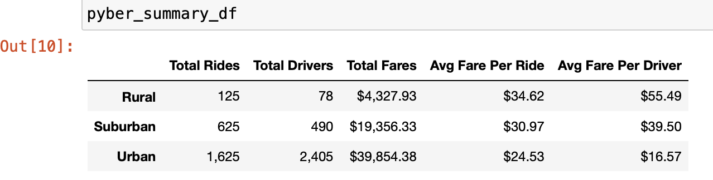
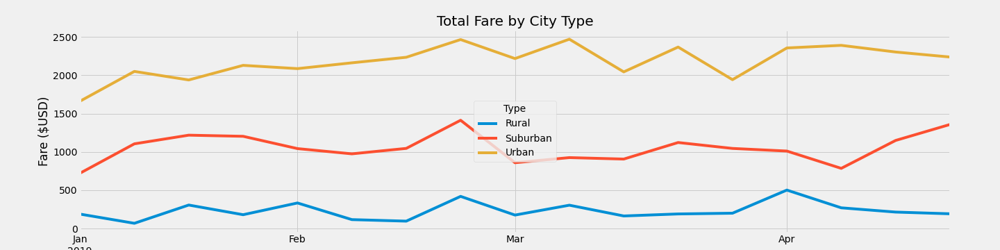

# PyBer Analysis
## Project Overview
The client asked for a graph showing the total weekly fares by city type which includes Rural, Urban, and Suburban. The first step was to find the total rides, number of drivers, and fares for each city type.  Then, the second step was calculating the average fares per number of drivers and rides per city type. Lastly, the data was indexed based on a range of dates (Jan. 2029-Apr. 2019) and the date data was converted to weekly time frequency.

## Results
Rural cities have the lowest total number of rides, drivers, and fares; however, they have the highest average fare per ride and average fare per driver. This is likely due to lower demand resulting from a smaller population.  On the other hand, urban cities that are more polulated are able to offer the lowest average fares per ride and per driver, and they have the highest total number of rides, drivers, and fares. Suburban cities fall in the middle on all data categories. Refer to chart below for a summary of the data.

Based on graph below, the weekly fares by city type do not show distinct patterns nor does there appear to be any correlation across the results.  The fares appear to be relatively consistent across each city type, and the graph shows the higher level of fares in urban cities compared to the other city types. 

## Summary
Based on the results, there are a few business recommendations:  
1. To make the rides more affordable in rural cities for underprivileged peoples, the business could provide subsidies for lower-income households or increase the number of drivers to shift the supply curve to the right as rural cities have the highest fares per ride and driver.
2. Only urban cities have more drivers compared to the number of rides given. Thus, to enusre adequate availability across all city types, the buisness should increase the number of drivers in suburban and rural cities.  
3. While icreasing availability is important and a recommendation, the buisness should also consider the optimal number of drivers in each city type to ensure  equilibrium demand is captured.  This will help the business opperate efficiently and manage its revenue and costs. 
